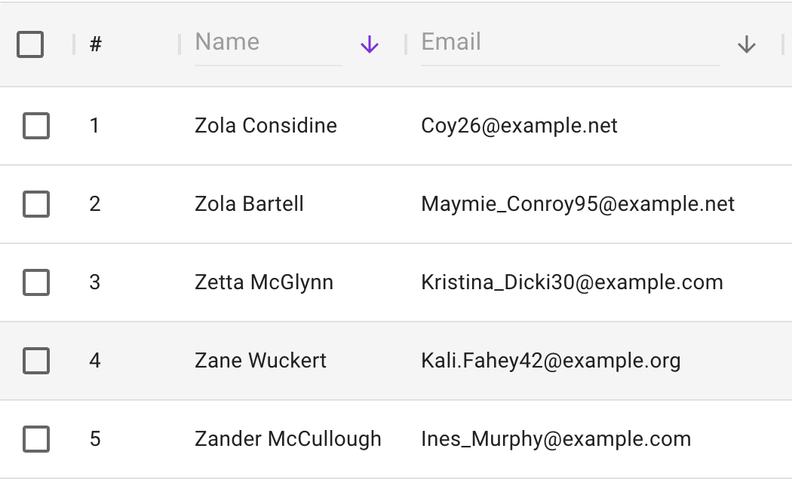
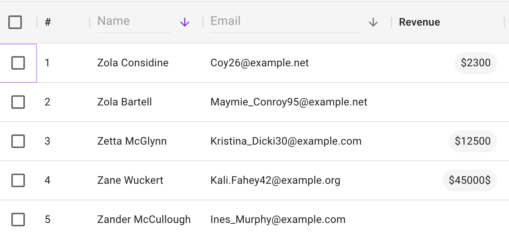

## 🍋 Lemon.io backend developer test task

### Introduction
You are a backend developer responsible for developing an API for the internal products of a company that offers developers work contracts with various companies.

The API is used in two frontend applications - contracts dashboard and developers management dashboard. The developers management dashboard looks as shown below.


The product manager comes with updated requirements - in the developers management dashboard, it is necessary to display the revenue by all completed contracts for a specific developer.



You are responsible for devising a technical solution and implementing these changes on the backend. Consider and implement changes for the new functionality that seem most optimal to you for this task.

### Execution Instructions
Deploy the archive into a new repository on GitHub and submit your changes as a pull request. Once ready, provide the link to the pull request. The goal of the task is not only to check the candidate’s hard skills but also to prove the ability of ownership of assigned work and check dedication to the team’s result

### Requirements
- Node.js 10+

### Installing application
`npm install --force`

### Running application locally
- Have application installed
- Run `npm run start:backend`

### Running tests
- Run `npm run test`

### Swagger documentation
The API endpoints are documented with Swagger documentation using the library swagger-express-ts
and can be found at http://localhost:3000/api-docs/swagger

### Directory Structure
```
-- src
    |-- domain				# application domain layer (services, repository, etc.)
    `-- rest				# REST api sources (controllers, swagger documentation)

```
